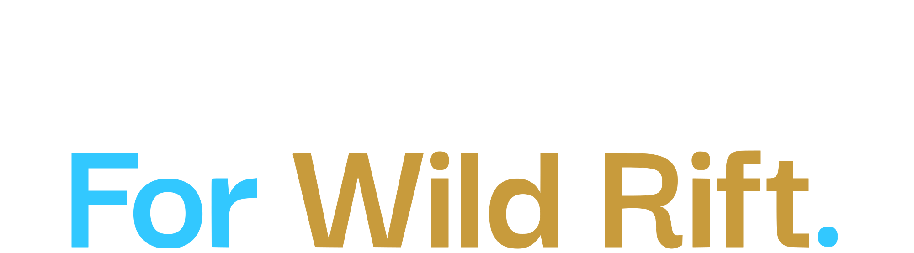

<p align="center">
  
</p>

# Draft Assistant For Wild Rift

[](https://github.com/deeplo23-ghub/wild-rift-assistant)
[](https://opensource.org/licenses/MIT)
[](https://github.com/deeplo23-ghub/wild-rift-assistant)
[](package.json)

**Draft Assistant For Wild Rift** is a premium tactical companion engineered to eliminate guesswork during the drafting phase of *League of Legends: Wild Rift*. Using high-fidelity meta-tracing and advanced heuristic modeling, it identifies mathematically optimal picks for any team configuration in real-time.

---

## 🛠️ Deep Tech Stack

The application is architected for maximum performance and a high-end "glassmorphic" feel.

| Layer | Technology | Purpose |
| :--- | :--- | :--- |
| **Framework** | Next.js 16 (App Router) | High-performance React framework with server-side rendering. |
| **Data Fetching** | tRPC + React Query | Type-safe API communication with proactive caching. |
| **State Management** | Zustand | Ultra-fast, reactive client-side store for real-time draft updates. |
| **Logic Layer** | TypeScript | Strict type-safety across the entire scoring lifecycle. |
| **Database** | Prisma + PostgreSQL | Relational modeling for Meta values, Counters, and Synergies. |
| **Styling** | Tailwind CSS v4 | Cutting-edge utility-first styling with high architectural flexibility. |
| **Motion** | Framer Motion + GSAP | Premium glassmorphism effects and physics-based micro-animations. |
| **Infrastructure** | Puppeteer + Cheerio | Automated web-scraping pipelines for meta-data ingestion. |
| **Quality Control** | Vitest + ESLint | Validation for algorithm integrity and code quality. |

---

## 📊 The Calculation Engine: Minute Algorithm Lifecycle

The assistant runs a deterministic 6-phase evaluation for every available champion whenever the draft state changes.

### 1. Contextual State Normalization
The engine captures the immutable `DraftState`:
- **Ally Matrix:** `[slot: Role | null, championId: string | null]`
- **Enemy Matrix:** `[slot: Role | null, championId: string | null]`
- **Ban Registry:** `Set<String>` of global bans.
- **Focus Context:** The specific Role (e.g., *Jungle*) and Side (e.g., *Ally*) currently being drafted.

### 2. The Final Score Equation
Each candidate champion $C$ is assigned a total score $S$ based on weighted heuristic components:

$$ S = \sum_{i=1}^{n} (V_i \cdot W_i) - P $$

*Where:*
- $V_i$: Variable component value (normalized 0-100 scale).
- $W_i$: Dynamic weight assigned to the component based on draft stage.
- $P$: Flat execution risk penalty based on composition fragility.

### 3. Step-by-Step Mathematical Attribution

| Phase | Component | Calculation Logic |
| :--- | :--- | :--- |
| **Phase 1: Meta Base** | **Meta Intensity** | $TierValue \times (WinRate \times 1.4) \times (PickRate \times 0.6)$. Baseline strength in current patch. |
| **Phase 2: Synergy** | **Synergy Score** | Evaluates $C$ against all locked Allies $A$. $Tags(C) \cap Tags(A)$ triggers multipliers (e.g. *Knockup* ⇄ *Yasuo Ult*). |
| **Phase 3: Tactical** | **Comp Balance** | Simulates resulting team stats for *CC*, *Durability*, *Initiation*, and *Range*. Fills missing critical gaps. |
| **Phase 4: Counter** | **Counter Score** | Queries direct matchup matrix for focused Role ($2.0 \times$) and soft global counters ($1.0 \times$) for other enemies. |
| **Phase 5: Damage** | **Profile Match** | Checks $AD / AP / True$ spread. If team overlaps $>70\%$ of one type, the opposite receives a scaling bonus. |
| **Phase 6: Risk** | **Risk Penalty** | Subtracts points for "High Execution" champions if the team already lacks peel or durability. |

### 4. Stage-Sensitive Weighting Logic
The engine shifts its priorities as the draft progresses:
- **Early Stage (Picks 1-2):** High weight on **Flexibility** ($W_{Flex}$) to prevent immediate counter-picking.
- **Mid Stage (Picks 3-4):** High weight on **Synergy** and **Comp Balance**.
- **Late Stage (Pick 5):** Extreme weight on **Countering** ($W_{Counter}$) since the opponent can no longer react.

---

## 🌌 Fun Fact: The Infinite Draft State

Calculating the "perfect" pick is a challenge of astronomical proportions. With 135 champions (as of early 2026), the total unique theoretical draft combinations (Bans + Picks + Roles) are:

$$ \binom{135}{10} \times P(125, 5) \times P(120, 5) \approx \mathbf{3.9 \times 10^{35}} $$

**How big is $3.9 \times 10^{35}$?**
- **Stars in the Universe:** $\approx 10^{24}$. There are more draft combinations than stars in the observable universe by a factor of **100 billion**.
- **Atoms in the Human Body:** $\approx 10^{27}$. There are more draft paths than atoms in **100 million people**.
- **Dr. Strange's "Endgame" View:** He saw 14,000,605 futures. He would need trillions of years to view every possible Wild Rift draft.

This is why our engine uses **O(1) synergy mapping** and **contextual pre-calculation**—it's the only way to navigate an effectively infinite search space in under 50ms.

---


## 🚀 Local Development Setup

To run **Draft Assistant For Wild Rift** natively:

### 1. Prerequisites
- **Node.js**: v20 or newer
- **PostgreSQL**: Local instance or Docker container
- **Git**: For repository cloning

### 2. Installation
```bash
# Clone the repository
git clone https://github.com/deeplo23-ghub/wild-rift-assistant.git
cd wild-rift-assistant

# Install project dependencies
npm install

# Setup Environment
cp .env.example .env
# Configure DATABASE_URL inside .env with your PostgreSQL string
```

### 3. Data Pipeline & Initialization
The assistant requires a fresh dataset to run calculations. Initialize the database schema and ingest meta-data:
```bash
# Push schema and generate Prisma client
npx prisma db push
npx prisma generate

# Run the scraping/seeding pipeline
npm run pipeline:full
```

### 4. Launch the Development Server
```bash
npm run dev
```
Navigate to `http://localhost:3000`.

---

## 🗺️ Future Roadmap
- [ ] **Adaptive Rune Suggestions:** Dynamic rune page recommendations based on the draft.
- [ ] **Win Probability Prediction:** Live percentage estimation of winning based on the composition.
- [ ] **Multi-League Meta:** Switchable meta sources (Standard vs Legendary Queue).
- [ ] **Teamfight Simulator:** Visual representation of how the team should engage.

---

## ⚖️ Legal Disclaimer
*Draft Assistant For Wild Rift isn't endorsed by Riot Games and doesn't reflect the views or opinions of Riot Games or anyone officially involved in producing or managing League of Legends: Wild Rift. League of Legends: Wild Rift and Riot Games are trademarks or registered trademarks of Riot Games, Inc. League of Legends: Wild Rift © Riot Games, Inc.*
